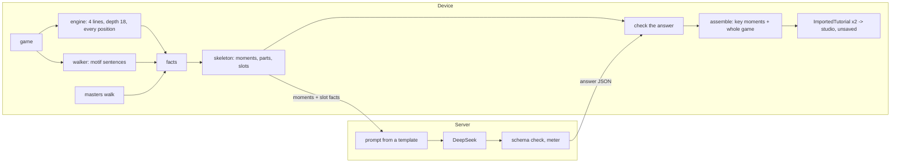

# A game becomes a tutorial on the device

Option A of 13.9.2026: port arm H of `tools/game_annotate/` into the app. The
skeleton — moments, positions, lines, questions, accepted answers, both modes —
is built on the user's device; a language model writes only the words, and it is
reached through our server because a key cannot live in an APK.

**The harness is the reference implementation, and stays one.** Everything this
plan ports was validated there first: thirteen games, every position exact,
every question the best move of the analysis sent, two hundred sentences read.
Where the app and the harness disagree, the harness is asked first.

## Settled, and not to be reopened

| | |
|---|---|
| Owner, 13.9.2026 | the LLM writes words only; the analysis is local; the skeleton is built by the app, not the server |
| Owner, 13.9.2026 | one answer yields two tutorials — key moments and the whole game; the trainer picks |
| Owner, 13.9.2026 | one board side throughout, no `blackOrientation`; the reader turns the board |
| Owner, 13.9.2026 | the analysis sent is the only source of truth; nothing re-searches to judge an answer |
| Harness, 13.9.2026 | depth 18, four lines, an empty hash per position — depth 20 changed no answer (54 of 54) |
| Harness, 13.9.2026 | the opening line and „left the masters database" earn their place; the detector is silent in book |
| `PLAN-PGN-TUTORIJAL.md` | no second PGN parser anywhere, the server included; everything lands in `positionList` |

## What already exists

| | what it gives this plan | what it lacks |
|---|---|---|
| `StockfishService.analyzePositionSync` | depth + multiPV search of one FEN, callbacks filtered by FEN | **returns whatever it has when the timeout fires** — a silent downgrade; no `ucinewgame` |
| the `stockfish` plugin (Android) | nothing here — the studio is Windows-only | **one instance** (`StateError: Multiple instances are not supported`); the question to reopen if the studio ever reaches a phone |
| the downloaded engine (Windows) | a binary the builder can start several times, one UCI process a position | nothing runs more than one today |
| Windows | a downloaded local engine through `EngineDownloadService` | without it the service falls back to `stockfish.online`, which cannot build facts |
| `GameAnalysisWalkerService` + `TacticalMotifDetector` | the motif sentence for every move — the same text the harness read out of a reviewed PGN | runs at depth 14, one line |
| `EvalCache` | positions shared between review, auto-tree and puzzles | memory only; keyed without the engine |
| `chess_app/tool/review_game.dart` | a headless analyzer speaking UCI to a binary — the pattern for a parity tool | |
| `readTutorialJson` → `ImportedTutorial` | pre-flight report, the studio banner, the save path, the grader | |
| `openingJudgeService.js` | the backend already asks the **masters** database with the shared token | no route that walks a game |
| `entitlementService.js` | `requireEntitlement`, `consumeQuota`, `recordUsage`, `METRIC` | no tutorial feature |
| `geminiService.js`, `narrativeGuard.js` | the shape of a model call with a structural guard | Gemini only — the owner cannot pay Google; DeepSeek is what the harness validated |

## 1. What runs where



**On the device**, ported from the harness:

| harness | app | what it does |
|---|---|---|
| `make_facts.py` `build`, `set_cost`, stands-out | `GameFactsBuilder` | every position: four candidates with eval and a six-ply line; the move played scored from the next position's search; cost, rank, stands-out |
| the reviewed PGN's comments | the walker's `combinedComment` | `motifs_after_played`, silenced while in book |
| `probe_masters.book_walk` | a call to the server (below) | `book`, `left_book` |
| `skeleton.moments` | `momentsOf(facts)` | candidates ≥ 1.0 pawn, parts, slot texts and slot facts |
| `skeleton._claims`, the checks in `assemble` | `checkAnswer` | chosen ⊆ offered, missing and unused slots, claims the facts do not bear |
| `assemble`, `whole_game`, `LEXICON`, `mistake_kind` | `assembleTutorials` | both `positionList`s, the filler and its lexicon |

**On the server**, and only this: the masters walk (the token is the server's),
and one route that turns a skeleton into words.

**The client never sends a prompt.** A route that forwards a prompt is our key
as an open proxy for anything. The app sends the skeleton as data — moment ids,
labels, the move played, the best move, the correct answers, the slot ids and
their fact texts — and the server writes the prompt from its own template, which
is the harness's `PROMPT` moved there as the one copy. What a modified client can
still do is put words into slot texts; that is bounded by the answer schema, a
token ceiling and the quota, and it is stated rather than hidden.

**The server checks shape, the app checks truth.** The server refuses an answer
that is not the schema — chosen ids not offered, slot ids not offered, over the
length caps — and meters it. The claims check runs in the app, next to the facts
it judges against, and what it finds goes into the pre-flight report the studio
already shows. Reported, never patched — the harness's rule.

## 2. The call

```
POST /lessons/from-game/words
{ "game": "<movetext>", "opening": "<the header line or null>",
  "moments": [ { "id": "m1", "label": "22... bxa3", "mover": "Black", ...,
                 "slots": [ { "id": "m1.lead.1", "text": "<facts>" }, ... ] } ] }
200 { "title", "description", "tags", "chosen", "slots" }
402  not entitled          429  quota spent, or a render-queue-style limit
422  the model's answer was not the schema (after one retry on the server)
503  no provider configured, or it did not answer — a sentence, not a stack
```

- **Synchronous.** The harness measured 24–69 s for the words with
  `deepseek-flash`; the server's call times out at 100 s and the app's request at
  120 s, both under nginx's 300. A job queue is not needed for one call under two
  minutes, and `renderJobs.js` is where to look if that changes.
- **The engine half comes first and costs nothing.** No request is made until
  the facts exist, so a cancelled or failed analysis never spends quota.
- **The answer is checked twice**: shape on the server, truth in the app. Then
  both tutorials are assembled from it, and the trainer picks which to open. The
  other is not thrown away until the dialog closes — it is free.
- **Both open unsaved in the studio**, through `ImportedTutorial`, exactly like a
  file import: the banner, the save path and `grade_tutorial.dart` need nothing
  new.
- **English only in this plan.** The template, the lexicon and the fact texts are
  English, and `language` is written as `en`.

## Windows only, and what that buys

**The tutorial studio exists only on Windows** (`isTutorialStudioAvailable`,
decision 5 of `PLAN-TUTORIJAL.md`), and a generated tutorial opens in the
studio. So the generator lives where the studio does, and a phone is not a
target of this plan (owner, 13.9.2026). The day the studio reaches Android, the
single-instance plugin is the question to reopen.

**Windows can do what the harness did.** The plugin allows one engine, but on
Windows the engine is a downloaded binary, and nothing stops the builder
starting several UCI processes of it — one single-threaded process a position,
as `make_facts.py` does with `--workers`, and as `tool/review_game.dart` already
speaks UCI to a binary. The harness measured that shape at 49–88 s a game at
depth 18 on eight cores. The builder owns its processes and never touches the
`StockfishService` singleton, so a live evaluation bar cannot cross-talk with it.

**The depth is the trainer's choice, with a floor** (owner, 13.9.2026: 18 was a
measurement, not a law). Offered: **18** (the default, remembered), **20** and
**22**. Not below 18, because that is where the thresholds were validated —
depth 12 changed two of nine question answers, depth 18 changed none of 54 — and
a lower choice stays closed until it is measured the same way. Depth 20 cost
about 3× the time of 18. The depth travels in the facts, so a tutorial says what
it was built from.

Four rules hold at any depth:

1. **A search that did not finish is not a fact.** `analyzePositionSync` returns
   partial lines at its timeout. The builder checks every answer reached the
   asked depth with the asked number of lines, and a position that did not is
   retried once and then fails the run with a sentence. This repository's
   recurring bug is exactly a step that reports success on less than it did.
2. **An empty hash per position** (`ucinewgame`), as the harness does — measured
   free, and it makes a facts file a function of the position, the depth and the
   engine alone.
3. **A local engine or nothing.** Without a downloaded engine the button offers
   the download; `stockfish.online` never builds facts.
4. **The facts are kept on the device**, by game, depth and engine, so an
   interrupted run resumes rather than starts again, and a second tutorial of
   the same game — or the same game at another mode — costs no engine time.

## One button, one run

**The trainer does not analyse first and ask second.** „Review entire game"
runs at depth 14 with one line; the facts need four lines at 18 or more, so a
review done first would be searched again anyway and the step would teach the
trainer a ritual that saves nothing. One press runs the whole chain: engine,
masters walk, skeleton, words, both tutorials.

**It stops by itself in exactly two places, both before anything is spent:**

- **the facts offer fewer than two moments** — a well-played game (the harness
  met one, `g08`, with exactly two) — and the dialog says so instead of asking a
  model to make a tutorial out of nothing;
- **the request would spend a credit** — once credits exist (D2), the dialog
  says what it found („3 moments worth teaching, about 40 s to write them") and
  asks once. Until then a premium account goes straight through.

A cancel during the engine half stops the processes and spends nothing; the
facts already built are kept.

## 3. Roadmap

Each phase ends with its tests counted, `flutter analyze` compared, and a
`TODO-provera.md` item where something can only be seen running.

### Phase 0 — measure on Windows (lead, no app code shipped)

- **Parity.** `chess_app/tool/game_facts.dart`, shaped like `review_game.dart`:
  builds facts for the ten games through the app's own services and the
  downloaded binary, several processes at once, and compares with
  `tools/game_annotate/input/`. Byte-identity is not the bar — two engine builds
  differ — the bar is the same moments and the same question answers, which is
  what the depth-18 decision was measured on.
- **Time.** Seconds a game at 18, 20 and 22 with the worker count the machine
  has, so the depth choice can say how long each takes.
- There is no phone half: the studio is Windows-only.

### Phase 1 — the skeleton in Dart (gate by the lead, translation by a worker)

The pure half: `moments`, the slot texts, `_claims`, `assemble`, `whole_game`,
`LEXICON`, `standing`, `mistake_kind`, `words_for`, `book_words`, `cost_text`,
into `lib/features/tutorial_studio/services/game_tutorial/`.

- **Fixtures written by the harness, read by the app** —
  `tools/game_annotate/export_fixtures.py` writes, per game, the facts, the
  model's `answer.json`, and the expected `tutorial.json`, `tutorial-game.json`
  and slot texts into `chess_app/test/fixtures/game_tutorial/`. Same shape as
  `spoken_moves_cases.json`: one file of expectations, read by both ends, so the
  two cannot drift.
- **The gate:** for all ten games, from facts + answer, the Dart code produces
  both `positionList`s JSON-equal to the harness's, and every slot text
  byte-equal. Plus the claims and assembly reports equal.
- **Proved satisfiable first**: the lead ports `words_for` and `standing` against
  the gate before the batch is handed over; mutation-proved before it is trusted.
- **Why a worker fits:** a byte-parity gate over ten games is a grader that
  cannot be argued with, and the work is translation with no design left in it.

### Phase 2 — facts on the device (lead: engine; worker: the pure part)

- `GameFactsBuilder` over a `PositionAnalyzer`, so tests inject one. **A fake
  analyzer answering from the ten facts files reproduces their rows** — cost,
  rank, stands-out, the played move's eval, mate handling — which gates the pure
  arithmetic of `make_facts.py` without an engine.
- The engine half: depth-and-lines check, one retry, `ucinewgame`, the local
  engine rule, the on-device facts store. Lead's, because every rule above is a
  place where a silent success hides.
- The masters walk: `GET /opening-explorer/masters-walk` on the server, stopping
  at the first position master games never reached, reusing
  `openingJudgeService`'s client; the app writes `book` and `left_book` and
  silences the detector where the game is in book.

### Phase 3 — the words route on the server (gate by the lead, worker)

- `services/llm/deepseek.js` (OpenAI shape, `DEEPSEEK_API_KEY` added to
  `.env.example`), `services/tutorialWords.js` with the template, and the route.
- **The prompt is a fixture**: for three games, the server's prompt from the
  app's skeleton JSON is byte-equal to the harness's `prompt.md`.
- Schema check, caps, one retry, entitlement, `consumeQuota`, `recordUsage` with
  tokens; tests with a fake provider, run with `.env` moved aside.

### Phase 4 — the door (lead, with a trial build before any batch)

- „Make a tutorial from this game" in **both** places a game is already loaded —
  Analysis with a game, and a game in the archive (owner, D4) — drawn only where
  `isTutorialStudioAvailable`.
- The depth choice (18 / 20 / 22, with the measured time beside each), then one
  run: a progress dialog that says what it is doing and how long is left, a
  cancel that stops the engine processes, the two stops of „One button, one
  run", the words, and **Key moments** / **Whole game** — both built, one opened.
- Every refusal a sentence: no local engine, quota spent, provider down, a run
  interrupted. Tested at 360 × 640, with the engine and HTTP behind debug seams.

### Phase 5 — documents and the live check

`TODO-provera.md` item 161, `STANJE-RADA.md`, the counts in `CLAUDE.md`.

## Decisions for the owner

| | question | answer |
|---|---|---|
| D1 | the depth | **the trainer's choice**, 18 / 20 / 22, default 18; nothing lower until measured (owner, 13.9.2026) |
| D2 | who gets it | **premium accounts, and free accounts that buy credits**. No credit system exists yet, so phase 3 gates on a new `AI_TUTORIALS` entitlement granted to the paid tiers and records every use with its tokens; credits are a plan of their own, and the usage rows are what it will read |
| D3 | the provider | **`deepseek-flash`, `reasoning_effort: low`** — the model of every validated run. Measured on the ten games: 24–69 s and 10.5–22.8 k tokens a tutorial, 15.5 k on average, of which about two thirds are the answer and its thinking |
| D4 | where the door is | **both**: Analysis and the game archive |

## Not in this plan

- Languages other than English — the template, lexicon and facts are English.
- Arm I, a comment on every move.
- Analysis on the server, and batch generation over a library.
- Android and iOS — the studio does not exist there.
- The credit system (D2) — this plan meters, a later one sells.

## First concrete steps

1. ✅ 13.9.2026 **`export_fixtures.py`** and the fixture folder — the parity
   gate's data. Ten games, 1.7 MB, `--check` proved by two mutations
   (`tools/game_annotate/README.md`, „Fixtures for the app's port").
2. **Phase 0** (`tool/game_facts.dart`) — parity and time on Windows, the lead.
3. ✅ 13.9.2026 **The phase 1 gate** plus `words_for` and `standing` ported
   through it and mutation-proved. `evaluation_words.dart` is held to every
   evaluation of the ten games and to boundary cases the harness answered
   (`test/game_tutorial_evaluation_words_test.dart`, ten mutations of ten
   caught). The gate for the rest is `docs/gates/game_tutorial_skeleton_test.dart`,
   with the frozen API, eleven places Python and Dart disagree, and five bad
   answers the harness judged. **Its one comparison that is not byte equality —
   a part's `pgn`, read back through `LessonStepLine` — was proved passable
   first**: every part of every fixture, rebuilt through
   `StudioLessonStep.from`, reads back as the harness wrote it.
4. ✅ 14.9.2026 **Batch 70 to the worker**: the rest of the skeleton, against
   that gate — PASS in one round, merged with three lead fixes. The ten games
   never reach two rounding rules (Python's `round` on an exact half, `'%.1f'`
   on an exact tie) and the port had both wrong; `edge_cases.json`, written by
   the harness, reaches them now, with a cost tie across the cut and a castling
   answer. Fifteen mutations, all caught. **Phase 1 is done.**
